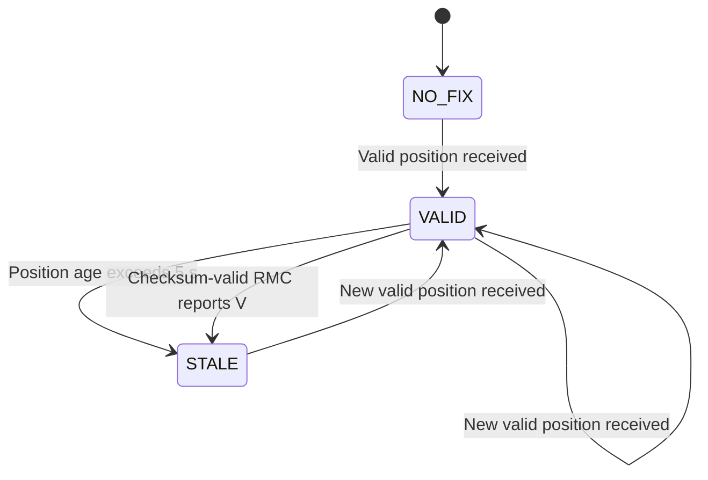

# Software Behaviour

Status: Draft
Related requirements: SWR-001 to SWR-011

## Position states

- NO_FIX: no valid position has been received since startup.
- VALID: the stored position is recent and no fix loss has been reported.
- STALE: a position is stored, but it is outdated or fix loss was reported.

## Processing rules

1. Receive and assemble a complete NMEA sentence.
2. Validate the sentence before using its fields.
3. Update the stored position only when a valid position is received.
4. Process an explicit fix-loss indication without replacing the stored coordinates.
5. Re-evaluate position age even when no UART data arrives.
6. Publish a consistent snapshot of the latest state every 2 seconds
   while MQTT is connected.
7. Keep GPS acquisition active during network outages.

Malformed sentences do not refresh position age.
The previous position is retained when its state becomes STALE.

## Network behaviour

Network connection state and position state are independent.
A VALID position does not imply an MQTT connection.
An MQTT connection does not imply a VALID position.

No position history is queued during disconnection.

## Architecture boundary

This document specifies behaviour, not the number of FreeRTOS tasks.
Task allocation and communication mechanisms will be defined separately.